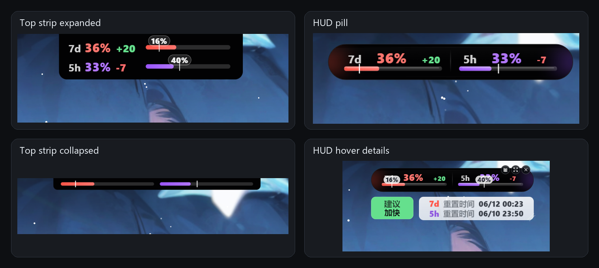

# Codex Quota Widget｜Codex 额度小组件｜Codex 额度监控器

Codex Quota Widget。它是一个 Windows 桌面悬浮小组件，用来查看本机 Codex 额度、重置时间和使用节奏。

关键词：Codex 额度、Codex 剩余额度、Codex 用量、Codex 使用限制、Codex 桌面小组件、Codex HUD、Codex 顶部细条、Codex 悬浮球、Codex quota widget。

本项目改造自 [xicunwus2025-sys/codex-led-widget](https://github.com/xicunwus2025-sys/codex-led-widget)。原项目提供了透明玻璃风格的 Codex 额度窗口，本改造版重点补上了更适合日常开发盯盘的紧凑 HUD、顶部吸附细条、7 天节奏判断、系统托盘和发布前源码清理。


## 主要改造

- 默认启动为紧凑 HUD，不占任务栏，适合长期放在桌面边缘。
- 同时展示 7 天窗口和 5 小时窗口的实际剩余额度、理想刻度、近速需留刻度和节奏差值。
- 增加顶部吸附细条：窗口贴近屏幕最顶部时自动切换为黑色小细条，只保留两条进度和理想刻度，减少遮挡浏览器标签页。
- 顶部细条支持鼠标悬停展开为类似 mac/iPhone 刘海的矩形面板，展示 HUD 未展开状态内容和理想刻度百分比。
- HUD 鼠标悬停时显示节奏建议、窗口重置时间、展开按钮、隐藏按钮和缩放手柄。
- 增加 7 天 + 5 小时融合的使用建议：加速蹬！、余量充足、节奏正常、近期偏快、继续放缓、建议减速、接近耗尽。
- v0.2.2 起新增学习型“近速需留”刻度：按近期速度、历史高峰/低谷和理想进度融合估算，避免 7 天窗口被短时间 1% 变化误判。
- v0.2.2 起新增灯效设置：可调整“近期偏快”黄色呼吸周期、“接近耗尽”红色闪烁周期和可见状态下的额度刷新间隔。
- 增加系统托盘入口，可显示/隐藏、刷新、切换紧凑模式、切换置顶、退出。
- 替换应用图标和托盘图标，打包产物使用 `CodexQuota.exe`。

## 截图

### v0.2.0 新版 HUD 与顶部吸附细条

下面的合成图展示 v0.2.0 新增的 HUD 胶囊、顶部吸附细条、细条展开态和 HUD 悬停展开态。

<p align="center">
  
</p>

### v0.1.1 旧版悬浮球截图

下面两张截图来自 v0.1.1。左侧的紧凑悬浮球是旧版形态，已被新版 HUD 和顶部吸附细条替代；完整额度窗口仍保留为主窗口参考。

<p align="center">
  
  
</p>

### 原项目截图

下面这些截图来自原项目 [xicunwus2025-sys/codex-led-widget](https://github.com/xicunwus2025-sys/codex-led-widget)，保留在仓库中用于对比改造前的界面方向。

<p align="center">
  
  
  
</p>

<p align="center">
  
  
</p>

## 下载和运行

前往 [Releases](https://github.com/stupdada/codex-quota-widget/releases) 下载最新版 `CodexQuota.exe`。

运行前需要满足：

- Windows 10 或 Windows 11。
- 已安装并登录 OpenAI Codex。
- 本机 Codex CLI 可以正常读取账号额度。

使用方式：

1. 下载 `CodexQuota.exe`。
2. 双击运行。
3. 首次运行如果 Windows 提示未知发布者，确认来源可信后选择“更多信息”再选择“仍要运行”。
4. 鼠标悬停在 HUD 上可以展开控制按钮、节奏建议和重置时间。
5. 将 HUD 拖到屏幕最顶部会切换为顶部细条；细条悬停时会展开为刘海式面板。
6. 右键或点击系统托盘图标可以显示/隐藏窗口、刷新额度、切换置顶或退出。

## 界面说明

紧凑 HUD 分成左右两组读数：

- `7d`：7 天窗口剩余额度，是节奏判断的主依据。
- `5h`：5 小时窗口剩余额度，作为短周期参考。

HUD 顶部吸附到屏幕边缘时会切换为细条模式：

- 收起态只显示 7 天和 5 小时两条进度，以及各自的理想剩余刻度。
- 悬停态展开为顶部刘海式面板，显示 HUD 未展开状态的核心信息和理想刻度百分比。
- 默认顶部居中吸附位置仍保留 HUD 形态；真正贴到屏幕最顶部时才进入细条模式。

### 刻度线

每条进度条会同时显示三类信息：

- 实际剩余：彩色进度条本身。
- 理想剩余：白色刻度线，表示如果额度匀速用到重置时间，此刻应该保留多少。
- 近速需留：青蓝色实线刻度，表示按近期速度和已学习的使用习惯，到重置前至少应该保留多少。

展开后的刻度百分比只显示数字，用颜色区分：白色是理想剩余，青蓝色是近速需留。当两个数字外框会碰到时，只显示理想数字，避免重叠。

### 近速需留算法

理想剩余是纯时间线性基准：

```txt
理想剩余 = 距离重置的剩余时间 / 窗口总时长 * 100%
```

近速需留是融合基准，不直接等于最近一个样本的硬外推：

- 5 小时窗口更灵敏：使用 15 / 30 / 60 / 120 分钟窗口估计近期速度，10 分钟后可显示，约 30 分钟达到满置信。
- 7 天窗口更稳定：使用 30 分钟、2 小时、6 小时、12 小时、24 小时、48 小时窗口估计近期速度，短样本只低权重参与，约 12 小时达到满置信。
- 速度估计按相邻历史样本计算真实消耗：只统计同一重置周期内 `上次剩余 - 本次剩余` 的正向消耗，避免重置后的 100% 被当成负消耗。
- 学习模型使用本地 168 个小时桶：按星期几 + 小时记录高峰和低谷，用 EMA 轻量更新；晚上不用、白天高峰、周末变化都会逐步体现在预测里。
- 跨重置历史会进入学习模型，但不会直接拿重置前后的百分比相减。
- 无有效历史时，近速需留退回理想剩余，因此不会因为样本不足消失。

历史样本保存在本机 `quota-history.json`，当前保留 14 天或最多 4096 条。计算只在刷新额度时运行，通常每次只需要毫秒级。

### 使用建议和光效

| 状态 | 含义 |
| --- | --- |
| 加速蹬！ | 余量显著高于理想线和近速需留线，且 5 小时窗口不紧张，可以更积极使用 |
| 余量充足 | 余量高于理想线和近速需留线，但还没到强提醒 |
| 节奏正常 | 接近理想线，近期速度也不危险 |
| 近期偏快 | 总体还行，但 5 小时窗口或近速需留线显示近期速度偏快 |
| 继续放缓 | 总体已低于理想线，但近期速度已经降下来，继续保持慢速 |
| 建议减速 | 总体和近期都偏快，实际剩余同时低于理想线和近速需留线 |
| 接近耗尽 | 7 天或 5 小时窗口剩余很低，或短周期已经接近耗尽 |
| 无法判断 | Codex 没有提供足够的窗口时长或重置时间 |

对应信号灯：

| 建议 | 信号灯 |
| --- | --- |
| 加速蹬！ | 白色常亮 |
| 余量充足 | 绿色常亮 |
| 节奏正常 | 蓝色常亮 |
| 近期偏快 | 黄色呼吸，默认 4 秒周期 |
| 继续放缓 | 黄色常亮 |
| 建议减速 | 红色常亮 |
| 接近耗尽 | 红色闪烁，默认 3 秒周期 |
| 无法判断 | 灰色常亮 |

`加速蹬！` 的门槛会随 7 天窗口距离重置的远近动态变化：离重置越远越克制，越接近重置越容易提示加速。当前规则是 `clamp(8, 35, 7d 理想剩余额度 * 0.5 + 5)`，并且 5 小时窗口偏快或紧张时不会触发。

系统托盘里的“灯效设置...”可以调整：

- `近期偏快` 黄色呼吸周期：1 到 20 秒。
- `接近耗尽` 红色闪烁周期：1 到 20 秒。
- 可见状态下的额度刷新间隔：1 到 30 分钟。

完整窗口中仍保留总剩余额度、5 小时窗口、7 天窗口、计划类型和节奏指标。


## 本地开发

安装依赖：

```bash
npm install
```

开发运行：

```bash
npm run dev
```

运行节奏判断和额度规范化测试：

```bash
npm run test:pace
```

用本机历史样本模拟近速需留算法：

```bash
node scripts/simulate-dynamic-velocity.js
```

打包 Windows 便携版：

```bash
npm run build
```

构建完成后，便携版可执行文件位于：

```txt
dist/CodexQuota.exe
```

## 项目结构

```txt
codex-quota-widget/
├─ assets/                  # 截图、应用图标和托盘图标
├─ scripts/                 # 本地验证脚本
├─ src/main/                # Electron 主进程、额度读取和节奏计算
├─ src/renderer/            # 界面 HTML/CSS/JS
├─ src/shared/              # 主进程和界面共用的布局常量
├─ package.json             # 应用元数据和 electron-builder 配置
└─ README.md
```

## 发布说明

当前发布版本：`v0.2.2`

发布产物：

- `CodexQuota.exe`：Windows x64 便携版。

本项目当前未做代码签名，因此 Windows 可能显示未知发布者提示。这不是联网拦截，也不代表程序会上传数据；只是因为可执行文件没有商业代码签名证书。

## 与原项目的关系

原项目：[xicunwus2025-sys/codex-led-widget](https://github.com/xicunwus2025-sys/codex-led-widget)

本改造版保留 Electron 桌面小组件的基本方向，在此基础上重新整理了额度读取、节奏计算、紧凑 HUD、顶部吸附细条、托盘交互、图标和发布文档。仓库历史会保留原项目提交，方便追溯改造过程。

## License

MIT License
