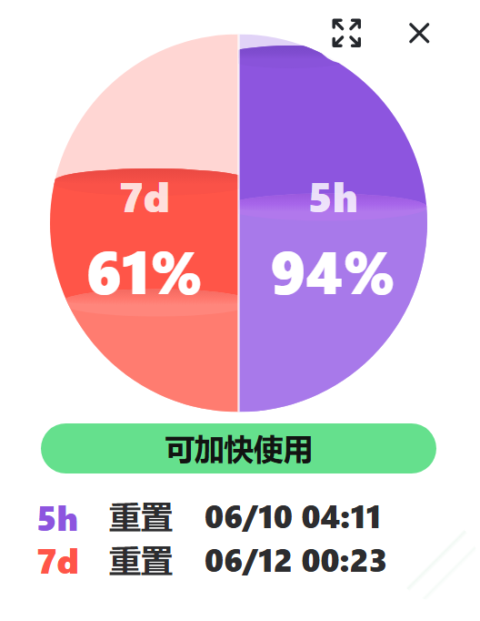
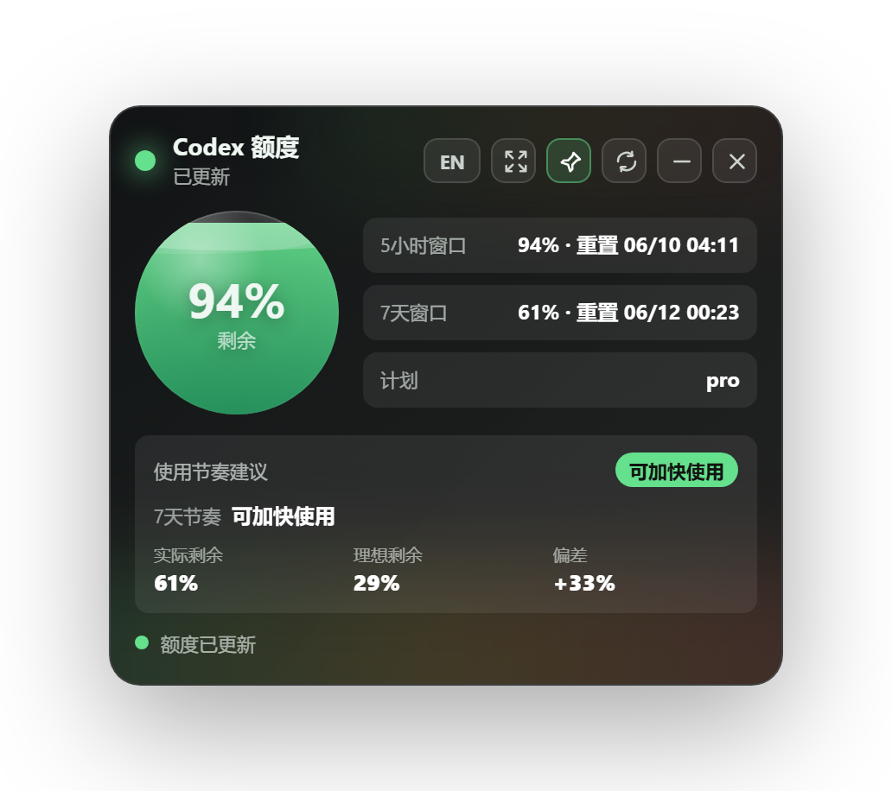

# Codex Quota Widget

Codex Quota Widget 是一个 Windows 桌面悬浮小组件，用来查看本机 Codex 额度、重置时间和使用节奏。

本项目改造自 [xicunwus2025-sys/codex-led-widget](https://github.com/xicunwus2025-sys/codex-led-widget)。原项目提供了透明玻璃风格的 Codex 额度窗口，本改造版重点补上了更适合日常开发盯盘的紧凑悬浮球、7 天节奏判断、系统托盘和发布前源码清理。


## 主要改造

- 默认启动为紧凑悬浮球，不占任务栏，适合长期放在桌面边缘。
- 同时展示 7 天窗口和 5 小时窗口的剩余额度。
- 增加 7 天使用节奏建议：可加快使用、正常、建议减速、接近耗尽。
- 在悬浮球里显示实际剩余额度和理想剩余额度的液面位置，方便判断当前消耗是否超前。
- 鼠标悬停时显示窗口重置时间、展开按钮、隐藏按钮和缩放手柄。
- 增加系统托盘入口，可显示/隐藏、刷新、切换紧凑模式、切换置顶、退出。
- 替换应用图标和托盘图标，打包产物使用 `CodexQuota.exe`。

## 截图

### 本改造版截图

下面两张截图来自本改造版，展示新增的紧凑悬浮球和完整额度窗口。

<p align="center">
  
  
</p>

### 原项目截图

下面这些截图来自原项目 [xicunwus2025-sys/codex-led-widget](https://github.com/xicunwus2025-sys/codex-led-widget)，保留在仓库中用于对比改造前的界面方向。

<p align="center">
  
  
  
</p>

<p align="center">
  
  
</p>

## 下载和运行

前往 [Releases](https://github.com/stupdada/codex-quota-widget/releases) 下载最新版 `CodexQuota.exe`。

运行前需要满足：

- Windows 10 或 Windows 11。
- 已安装并登录 OpenAI Codex。
- 本机 Codex CLI 可以正常读取账号额度。

使用方式：

1. 下载 `CodexQuota.exe`。
2. 双击运行。
3. 首次运行如果 Windows 提示未知发布者，确认来源可信后选择“更多信息”再选择“仍要运行”。
4. 鼠标悬停在悬浮球上可以展开控制按钮和重置时间。
5. 右键或点击系统托盘图标可以显示/隐藏窗口、刷新额度、切换置顶或退出。

## 界面说明

紧凑悬浮球分成左右两个半球：

- `7d`：7 天窗口剩余额度，是节奏判断的主依据。
- `5h`：5 小时窗口剩余额度，作为短周期参考。

节奏建议基于 7 天窗口计算：

| 状态 | 含义 |
| --- | --- |
| 可加快使用 | 当前 7 天剩余额度高于按时间推算的理想剩余额度 |
| 正常 | 当前消耗与时间进度基本一致 |
| 建议减速 | 当前 7 天剩余额度低于理想剩余额度 |
| 接近耗尽 | 7 天剩余额度不高于 5% |
| 无法判断 | Codex 没有提供足够的窗口时长或重置时间 |

完整窗口中仍保留总剩余额度、5 小时窗口、7 天窗口、计划类型和节奏指标。


## 本地开发

安装依赖：

```bash
npm install
```

开发运行：

```bash
npm run dev
```

运行节奏判断和额度规范化测试：

```bash
npm run test:pace
```

打包 Windows 便携版：

```bash
npm run build
```

构建完成后，便携版可执行文件位于：

```txt
dist/CodexQuota.exe
```

## 项目结构

```txt
codex-quota-widget/
├─ assets/                  # 截图、应用图标和托盘图标
├─ scripts/                 # 本地验证脚本
├─ src/main/                # Electron 主进程、额度读取和节奏计算
├─ src/renderer/            # 界面 HTML/CSS/JS
├─ package.json             # 应用元数据和 electron-builder 配置
└─ README.md
```

## 发布说明

当前发布版本：`v0.1.1`

发布产物：

- `CodexQuota.exe`：Windows x64 便携版。

本项目当前未做代码签名，因此 Windows 可能显示未知发布者提示。这不是联网拦截，也不代表程序会上传数据；只是因为可执行文件没有商业代码签名证书。

## 与原项目的关系

原项目：[xicunwus2025-sys/codex-led-widget](https://github.com/xicunwus2025-sys/codex-led-widget)

本改造版保留 Electron 桌面小组件的基本方向，在此基础上重新整理了额度读取、节奏计算、紧凑悬浮球、托盘交互、图标和发布文档。仓库历史会保留原项目提交，方便追溯改造过程。

## License

MIT License
